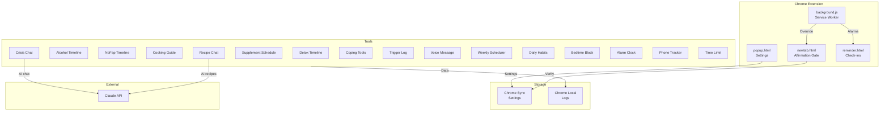
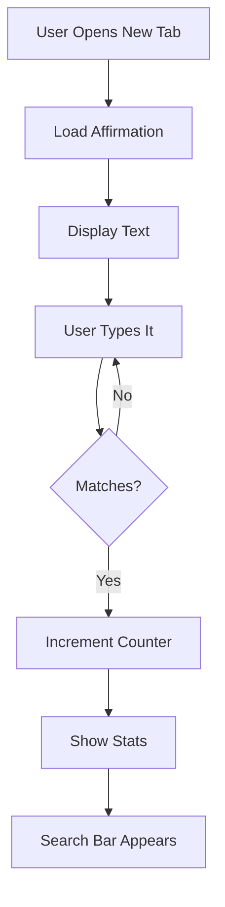
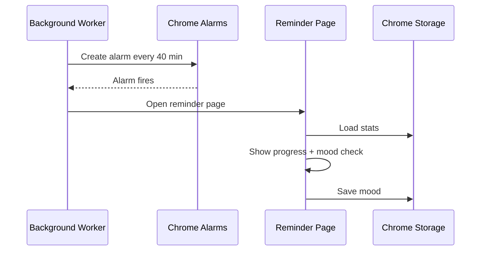

# Quit Reminder — Architecture

## Extension Structure

```mermaid
flowchart TD
    subgraph Chrome Extension
        BG[background.js<br>Service Worker]
        NT[newtab.html<br>Affirmation Gate]
        POP[popup.html<br>Settings]
        REM[reminder.html<br>Check-ins]
    end

    subgraph Storage
        SYNC[Chrome Sync<br>Settings]
        LOCAL[Chrome Local<br>Logs]
    end

    subgraph Tools
        DT[Detox Timeline]
        AT[Alcohol Timeline]
        NF[NoFap Timeline]
        CG[Cooking Guide]
        RC[Recipe Chat]
        SS[Supplement Schedule]
        CC[Crisis Chat]
        CT[Coping Tools]
        TL[Trigger Log]
        VM[Voice Message]
        WS[Weekly Scheduler]
        DH[Daily Habits]
        BB[Bedtime Block]
        AC[Alarm Clock]
        PT[Phone Tracker]
        TIM[Time Limit]
    end

    subgraph External
        CLAUDE[Claude API]
    end

    BG -->|Alarms| REM
    BG -->|Override| NT
    POP -->|Settings| SYNC
    NT -->|Verify| SYNC
    CC -->|AI chat| CLAUDE
    RC -->|AI recipes| CLAUDE
    Tools -->|Data| LOCAL
```

## New Tab Flow

```mermaid
flowchart TD
    A[User Opens New Tab] --> B[Load Affirmation]
    B --> C[Display Text]
    C --> D[User Types It]
    D --> E{Matches?}
    E -- No --> D
    E -- Yes --> F[Increment Counter]
    F --> G[Show Stats]
    G --> H[Search Bar Appears]
```

## Reminder Flow

```mermaid
sequenceDiagram
    participant BG as Background Worker
    participant A as Chrome Alarms
    participant R as Reminder Page
    participant S as Chrome Storage

    BG->>A: Create alarm every 40 min
    A-->>BG: Alarm fires
    BG->>R: Open reminder page
    R->>S: Load stats
    R->>R: Show progress + mood check
    R->>S: Save mood
```
